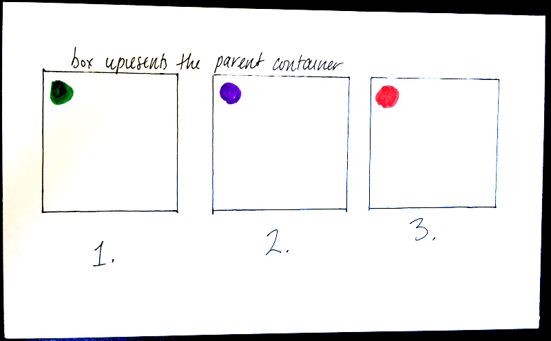

# CSS ANIMATIONS!!!!!

You know a little bit how to move stuff around with JavaScript.... now let's learn how to make it move around with CSS!!!

### Learning Objectives

- Understand how traditional hand-drawn keyframe animation and CSS animation relate
- Use the `animation` property to animate elements
- Use the `transform` property to change elements
- Recognize the different values for the `transform` property and see what they do
- Recognize the parts of keyframe syntax
- Analyze a description of an animation and understand at a high level what steps would be needed to reproduce it

## Transitions Redux

**Transitions** let us tell the browser how to change a property over time. You'll commonly see the `transition` property used on `:hover` and `:focus` states, as we talked about last week.

However, with `:hover` and `:focus`, we were mostly changing things like background color, font color, etc. Transition can be used with many more properties.

### ✨ Follow along in this [Codepen](http://codepen.io/jlr7245/pen/zZVJyL?editors=1100)!!

#### 📚 For reference:

The `transition` property is shorthand for a number of other properties -- like `border` is shorthand for `border-color`, `border-width`, etc. The syntax goes like this:

```css
transition: property duration timing-function delay;
/* property: which property the transition effect is for
   duration: how many seconds or milliseconds the transition effect takes
   timing-function: specifies the "speed curve" of the transition effect
   delay: defines with the transition effect will start */
```

So, if we were trying to write a transition rule that smoothly changes the background color over 2 seconds starting 1s after the action that causes the transition, we'd write:

```css
transition: background-color 2s ease 1s;
```

### Not all properties are "transitionable" or "animatable". 

Here's a table of the most common animatable & non-animatable properties. (It's not an exhaustive list; head over to [W3Schools](https://www.w3schools.com/cssref/css_animatable.asp) for the full list.)

| Animatiable                                                  | Not animatable                              |
|--------------------------------------------------------------|---------------------------------------------|
| `background-color`, `background-position`, `background-size` | `background-image`, `background-blend-mode` |
| `top`, `bottom`, `left`, `right`                             | `position`                                  |
| `height`, `width`, `min-height`, `min-width`                 | -                                           |
| `margin`, `border`, `padding`                                | `box-sizing`, `border-image`                |
| `opacity`, `visibility`                                      | `display`                                   |
| most text & font properties                                  | `font-family`                               |
| -                                                            | `float`, `clear`                            |


### Transitions are pretty cool.

But they have some limitations, at least in the way we're using them here. What if we don't want to have to hover over the circle to get it to move? What if it should move when the page loads? We could feasably force that with JavaScript and a `setTimeout`, but that puts us back in the world of DOM manipulation. There's an easier way...

## Keyframes & the `animation` property

### What is a "keyframe"?


Keyframes are a common animation concept, usually found in hand-drawn animation. In the above image, the figures in grey are **keyframes** - they define the starting, ending, or middle point of a smooth transition. The other drawings are **inbetweens** - they don't have to be drawn on a storyboard, because the animator can assume what they will look like without a visual reference.

In web-based animations, keyframes work the same way - they represent the begining, ending, or midpoint state of the element being animated. However, our inbetweens will be generated by code, instead of being filled in by hand later.

The `transition` property allows us to define a beginning and end point for a state change. However, sometimes you'll want to have an element move through multiple states during an animation. That's where the CSS keyframes rule comes in.

### 📚 Keyframe Syntax

Keyframe syntax uses `@`, just like media queries, but it looks a little different inside. Let's take a look at the bare bones of a keyframe rule:

```css
/* keyframes keyword, animation name */
@keyframes ANIMATION-NAME {
  /* description of the animation */
  0% {
    /* the beginning state of the animation */
    property: first-value;
  }
  50% {
    /* the middle state of the animation */
    /* you can have as many mid-points as you want,
       at whatever percentages you want. */
    property: second-value;
  }
  100% {
    /* the ending state of the animation */
    property: third-value;
  }
  /* In order for anmiations to happen smoothly, you must
     animate the same property at every animation !! 
     For ex, to smoothly animate a circle from left to right,
     you wouldn't do `left: 0%;` and then `right: 0%;`. You have
     to keep animating `left`. */
}
```

And here is how you apply an animation rule to a CSS class:

```css
.animate-me {
  animation: NAME duration timing-function delay animation-iteration-count direction fill-mode play-state;
}
  /* This is sort of like the transition property shorthand: each of these does a different thing.
     - animation-name: specifies the name of the keyframe rule
     - animation-duration: specifies the number of seconds or milliseconds
     - animation-timing-function: specifies the "speed curve" of the animation
     - animation-delay: specifies a delay before the animation will start
     - animation-iteration-count: specifies how many times an animation should be played
     - animation-direction: specifies whether or not an animation should be played in reverse on alternate cycles
     - animation-fill-mode: specifies what values are applied by the animation outside the time it is executing
     - animation-play-state: specifies whether the animation is running or paused
     */
```

(definitions from [W3Schools](https://www.w3schools.com/cssref/css3_pr_animation.asp))

### Wait. What's a "speed curve"? What does "fill mode" mean?

These two are a little bit more obscure and difficult to explain. Here's my best attempt:

- A **speed curve** specifies the rate at which the paramaters change. [Here's an example site](http://easings.net/) with a bunch of speed curves. This is something you'll have to play around with -- check out the [W3Schools page](https://www.w3schools.com/cssref/css3_pr_animation-timing-function.asp) for `animation-timing-function`.
- The **fill mode** describes what happens to the animation after it's done running. Does it stay at the animation endpoint or does it go back to the beginning? If you set `animation-fill-mode` to `forwards`, the animation will stay in the `100%` state after it's finished. [See the W3Schools page](https://www.w3schools.com/cssref/css3_pr_animation-fill-mode.asp) for more information and examples.

### ✨ Follow along in the next [Codepen](http://codepen.io/jlr7245/pen/yMdZLv?editors=1100)!!

We'll animate this drawing together. I've done some pseudocoding beforehand, which may feel a little bit like overkill. 

But, like I was saying on Friday when we were talking about Rock Paper Scissors, it's good practice to get used to thinking about small problems in this way. Breaking up large problems into small pieces will be easier down the line.

| Keyframes Drawing                    | Description                                                                                                                                             | Expected property value                                                                                             |
|--------------------------------------|---------------------------------------------------------------------------------------------------------------------------------------------------------|---------------------------------------------------------------------------------------------------------------------|
|  | <ul><li>The circle does not move at any point.</li> <li>At first the circle is green</li> <li>Then it is purple.</li> <li>Finally, it is red.</li></ul> | <ol><li>`background-color: green;`</li> <li>`background-color: purple;`</li> <li>`background-color: red;`</li></ol> |

# 💥 Lab 1

### Practice with turning drawings into animations using keyframes!

- Find a group! Groups should be 3 or 4 people tops. You can also work in pairs.
- Create a fork of [this codepen](http://codepen.io/jlr7245/pen/BWgvxo?editors=1100).
- Come up and get an index card with an animation drawn on it!
- Write out the steps you think the animation will need.
- Make the animation happen! 

**Note**: You won't need to use the `transform` property for this lab. We're learning about that next 😉

***

## Transforms

- Go over the different families of transform properties
    - translate
    - scale
    - rotate
    - skew
- concept: when you rotate an element, everything inside the element also rotates
- we do together:
    - rotate a box with text in it first
    - rotate a box with a circle in it
    - rotate multiple boxes
    - hey look, we built a solar system

# 💥 Lab 2

### This is a choose-your-own-adventure lab!!

You can work on your own, in pairs, or in groups of three. Here are your options:

- Add another planet or two to the solar system we've been building!!
- Interested in how CSS animations can be used for microinteractions? I'll be doing a mini-lecture on that, based on a [dot wiggler](http://codepen.io/jlr7245/pen/zZemXE) I've been testing out. (I'll also walk through the DOM stuff that makes the gameboard generate randomly.)
- Get another index card and test out your skills with the `transform` property!!!
- Dig into one of the following examples & see if you can understand how it works. Any questions? Ask!
    - [Day Night Simulation](http://codepen.io/Catagen/pen/PqYdXR/)
    - [Flat design camera](http://codepen.io/damienpm/pen/esoJG/)
    - [Full CSS 3D Solar System](http://codepen.io/waynedunkley/pen/YPJWaz/?editors=1100)